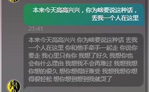
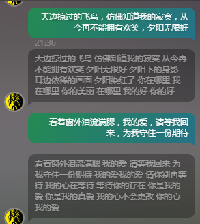
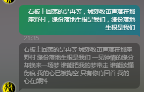
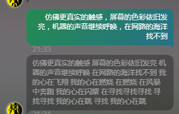

# Chinese song generation

Using seq2seq with attention to generate chinese song lyrics!

Main code is from [here](https://github.com/suriyadeepan/easy_seq2seq)
Chinese tokenizer is [jieba](https://github.com/fxsjy/jieba)


## Training

```bash
# edit seq2seq.ini file to set 
#		mode = train
# put lyrics into train.enc, train.dec, (test.enc, test.dec)
python execute.py
# or use custom ini file
#		python execute.py my_custom_conf.ini
```

## Testing

```bash
# edit seq2seq.ini file to set 
#		mode = test
python execute.py
```

## Serve

```bash
# configuration : seq2seq_serve.ini
# move work_dir to ui folder. modify checkpoint to be the checkpoint you want
python ui/app.py
# wait until this message shows up
#		"Running on http://127.0.0.1:5000/ (Press CTRL+C to quit)"
# open up the address in browser, chat with the bot
```
## Output examples




